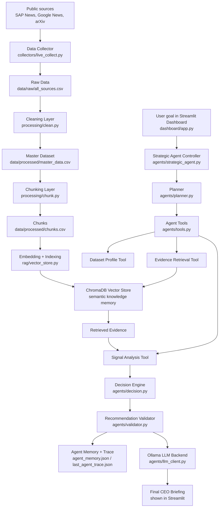
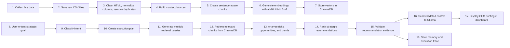

# SAP Agentic Strategic Intelligence System

## Project description

This project builds an AI-powered Strategic Intelligence Agent for SAP. The system collects public information about SAP, its competitors, market activity, enterprise AI trends, and related research. It then converts that information into an evidence-based CEO briefing.

The main question the project answers is:

> If you were the CEO of SAP today, what should management do next and why?

The project is not only a dashboard connected to an LLM. The LLM is used at the end to write the final briefing. The actual agent workflow is handled in Python: it plans, retrieves evidence, analyzes signals, creates recommendations, validates them, and saves memory from previous runs.

In the final local run, the system collected **473 documents** from **7 public sources** and created **1112 text chunks** for retrieval. The collected sources include SAP News Center, Google News searches for SAP, investor relations, competitors, enterprise AI trends, and arXiv research feeds.

---

## System architecture diagram

The architecture separates the agent logic from the language model. The Python modules control the workflow, while Ollama is only used for the final response wording.

---

## Data flow diagram

This flow shows the full path from public data collection to the final CEO recommendation. The same pipeline can be refreshed automatically, so the knowledge base does not depend on one static file.

---

## Technology stack

| Layer | Technology | Use in this project |
|---|---|---|
| Programming language | Python | Main implementation language |
| Dashboard | Streamlit | Interactive interface for asking strategic questions and viewing outputs |
| Data collection | feedparser, RSS feeds, Google News RSS, arXiv API | Collects public SAP, competitor, market, trend, and research data |
| Data processing | pandas | Reads, cleans, filters, deduplicates, and stores CSV files |
| Text cleaning | BeautifulSoup, regex | Removes HTML content and normalizes text spacing |
| Chunking | Custom sentence-aware chunking | Splits long documents into retrievable text chunks |
| Embedding model | sentence-transformers: all-MiniLM-L6-v2 | Converts chunks and queries into dense vectors for semantic search |
| Vector database | ChromaDB | Stores embeddings and retrieves relevant evidence chunks |
| LLM backend | Ollama, default model in config: phi4-mini | Produces the final natural-language briefing from validated context |
| Agent modules | Python files in `agents/` | Planning, tool use, decision-making, validation, memory, and final synthesis |
| Storage | CSV, JSON, ChromaDB files | Stores raw data, processed data, chunks, memory, and execution traces |
| Scheduler | Python threading in `start_dashboard.py` | Runs refresh checks while keeping the dashboard available |

---

## Design decisions

### 1. Agent logic is outside the LLM

The system does not depend on the LLM to perform every step. The agent controller in `agents/strategic_agent.py` handles the main workflow. It classifies the goal, creates a plan, uses tools, makes decisions, validates recommendations, and stores memory before the LLM writes the final answer.

### 2. Multi-source data collection

The project uses several public sources instead of only one company feed. This gives the agent a broader view of SAP's situation: company updates, competitor movement, investor-related news, enterprise AI trends, and research signals.

### 3. Sentence-aware chunking

The data is split into chunks of about 900 characters with overlap. This avoids cutting important context too aggressively while still keeping the chunks small enough for retrieval.

### 4. Semantic retrieval with fallback support

ChromaDB is the main retrieval layer. It stores embeddings created with `all-MiniLM-L6-v2`. The retriever also contains a keyword fallback so the demo can still run if the vector index is not available.

### 5. Multi-query retrieval

The planner does not use only the raw user question. It creates additional queries based on the detected intent, such as CEO strategy, risk assessment, opportunity discovery, trend strategy, or competitive strategy. This helps the agent collect stronger evidence before forming recommendations.

### 6. Validation before final answer

The validator checks whether recommendations are linked to retrieved evidence and whether enough source coverage exists. If evidence is weak, the system lowers confidence instead of presenting unsupported advice as fact.

### 7. Local memory and traceability

The agent saves previous goals, recommendation titles, validation status, and execution details in JSON files. This makes the workflow easier to inspect and helps show what the system actually did during each run.

### 8. Automatic refresh design

`start_dashboard.py` checks whether the processed data and vector store are ready. It can refresh the collection and indexing pipeline every 4 hours, using a lock file to avoid two pipeline runs happening at the same time.

---

## AI pipeline

The AI pipeline is divided into two parts: the data preparation pipeline and the agent reasoning pipeline.

### Data preparation pipeline

1. `collectors/live_collect.py` collects live public data from configured sources.
2. Raw results are stored in `data/raw/` and combined into `all_sources.csv`.
3. `processing/clean.py` removes HTML, normalizes text, filters short records, and creates `master_data.csv`.
4. `processing/chunk.py` creates sentence-aware chunks and saves them in `chunks.csv`.
5. `rag/vector_store.py` embeds the chunks using `all-MiniLM-L6-v2`.
6. The embeddings and metadata are stored in ChromaDB for semantic retrieval.

### Agent reasoning pipeline

1. The user enters a strategic goal in the Streamlit dashboard.
2. `agents/planner.py` classifies the goal and creates an execution plan.
3. The planner creates multiple retrieval queries instead of relying on one prompt.
4. `agents/tools.py` runs the dataset profile tool, evidence retrieval tool, and signal analysis tool.
5. `rag/retriever.py` retrieves relevant evidence chunks from ChromaDB.
6. The signal analysis tool identifies opportunity, risk, and trend signals from the evidence.
7. `agents/decision.py` ranks the top strategic recommendations.
8. `agents/validator.py` checks evidence support and confidence.
9. `agents/llm_client.py` sends only validated context to the Ollama model for final wording.
10. `agents/memory.py` saves the run summary in local memory.
11. The dashboard displays the final CEO briefing, evidence, plan, tools used, validation result, and execution trace.

The final output is therefore not a direct prompt-to-LLM answer. It is the result of a planned, evidence-based, multi-step agent workflow.
